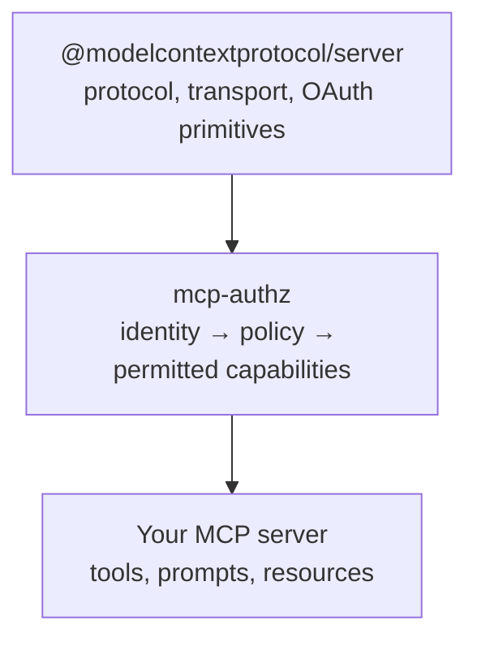
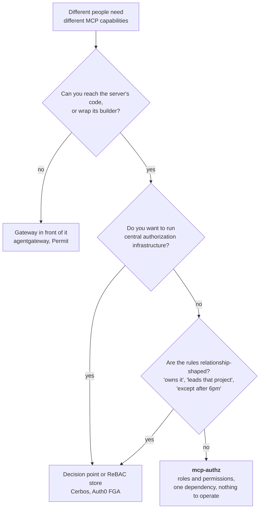
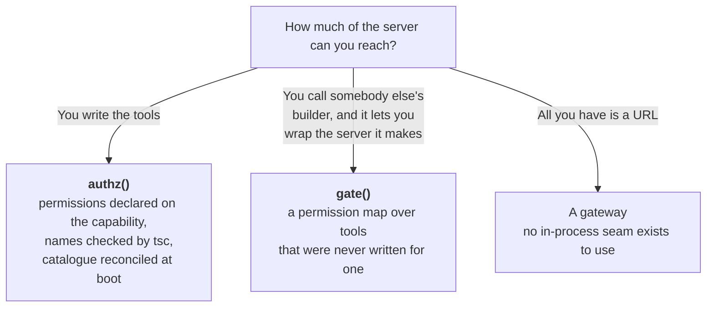
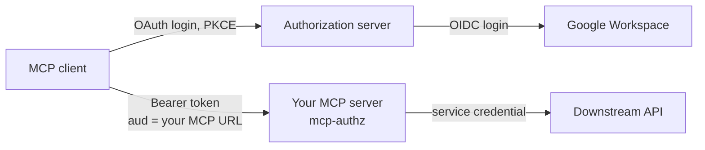
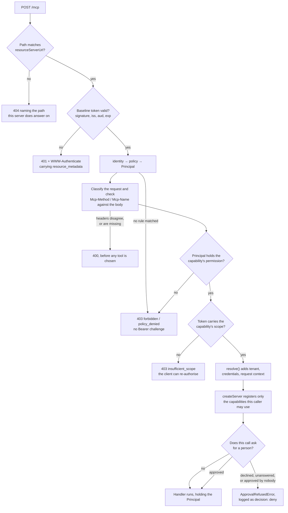

# mcp-authz

**Give an MCP server per-user permissions without deploying an authorization system.**

An OAuth 2.1 **resource server** plus an access policy, as a library you import rather than a proxy you deploy. Speaks MCP Streamable HTTP **2026-07-28**.

**[Documentation](https://jagreehal.github.io/mcp-authz/)** · [Quick start](https://jagreehal.github.io/mcp-authz/quick-start/) · [Run the example](https://jagreehal.github.io/mcp-authz/run-the-example/)

| Package                                           | Registry | What it is                                                    |
| ------------------------------------------------- | -------- | ------------------------------------------------------------- |
| [`mcp-authz`](packages/mcp-authz)                 | npm      | TypeScript library: JWKS, policy, permission-gated tools      |
| [`mcp-authz`](packages/mcp-authz-python)          | PyPI     | Python library built on the official `mcp` SDK v2             |
| [`mcp-authz-node-example`](apps/node-example)     | —        | Thin Node.js consumer that wires the library to a demo server |
| [`mcp-authz-python-example`](apps/python-example) | —        | Thin Python consumer using the official SDK                   |

You bring the authorization server (WorkOS, Stytch, Auth0, …). This package never runs consent, DCR, or PKCE. It verifies tokens whose audience is your public MCP URL, decides what the caller may do, and registers only the tools they may use.



One layer, between the SDK you already depend on and the tools you already wrote.

## Install

```bash
npm install mcp-authz @modelcontextprotocol/server   # TypeScript
pip install mcp-authz                                # Python, imports as mcp_authz
```

Both packages run the same versioned [conformance fixtures](conformance/README.md), so a policy decision means the same thing in either language. Their releases are independent: read the [TypeScript API](packages/mcp-authz/README.md) or the [Python API](packages/mcp-authz-python/README.md) for the one you are installing.

## Where it fits

Use it when you can reach the server's code, or wrap the builder that makes it, and the callers are people who already sign in somewhere. Dana reads cases, Alice also writes them, and that decision sits next to the handler running the query. You install a dependency, and you run nothing new.

Plenty of good tools solve the neighbouring problems. Take one of them when its row describes you:

| Approach                       | Example                | What you take on                                                       |
| ------------------------------ | ---------------------- | ---------------------------------------------------------------------- |
| MCP gateway                    | agentgateway           | A data-plane component to deploy and keep available                    |
| Gateway plus policy service    | Permit                 | The gateway, and the policy infrastructure behind it                   |
| External decision point        | Cerbos                 | A PDP to run, and a call out to it on every decision                   |
| Relationship-based permissions | Auth0 FGA              | Richer rules than this offers, in a second authorization system        |
| Framework feature              | FastMCP                | Convenience, tied to that framework                                    |
| OAuth plumbing                 | official SDK, mcp-auth | Authentication and resource-server mechanics, with no permission model |
| Embedded dependency            | **mcp-authz**          | One package, and a policy engine that stays small by design            |



Two cases need none of this. A stdio server on one laptop already has the OS account as its boundary. A server where every caller gets identical access wants one service credential and no policy.

### You need one integration seam

Which one you get decides the tool. Owning the source is the best case, not the
only one.



The middle rung matters more than it looks. A package you install, whose tools
somebody else wrote, still works here as long as its builder hands you the
server before returning it. That hook is two lines, and it is worth asking an
upstream maintainer for. Details in TypeScript
[`gate()`](packages/mcp-authz/README.md#gateserver-principal-permissions) and
Python [`gate()`](https://jagreehal.github.io/mcp-authz/python/gate/); the
[FastMCP comparison](packages/mcp-authz/README.md#fastmcp-and-canaccess) covers
the closest in-process alternative.

## See it work, without an authorization server

```bash
git clone https://github.com/jagreehal/mcp-authz && cd mcp-authz && pnpm install
pnpm --filter mcp-authz-node-example dev                  # :8200, local dev key
pnpm --filter mcp-authz-node-example token dana@acme.com  # reader
pnpm --filter mcp-authz-node-example token alice@acme.com # editor
```

Paste a token into the MCP Inspector. Dana sees `whoami` and `get_case`; Alice
also sees `update_case`; `sam@other.com` gets HTTP 403. Dana's write tool is not
hidden. It was never registered for her request. Full walkthrough in
[apps/node-example](apps/node-example/README.md).

## The shape

Three pieces: a policy, tools that name the permission they need, and the fetch handler that ties them together.

```ts
import { authz, createMcpFetch, definePolicy, discoverOAuth } from 'mcp-authz';
import { z } from 'zod';

const policy = definePolicy({
  roles: {
    reader: ['cases:read'],
    editor: ['cases:read', 'cases:write'],
    admin: ['*'],
  },
  rules: [
    { match: { domain: 'acme.com' }, role: 'reader' },
    { match: { email: 'alice@acme.com' }, role: 'editor' },
    { match: { claim: { 'https://acme.com/groups': 'qa-leads' } }, role: 'editor' },
    { match: { sub: 'auth0|departed-contractor' }, deny: true },
  ],
});

const { tool, prompt, resource, server } = authz(policy);

const createServer = server(
  [
    tool(
      'get_case',
      { permission: 'cases:read', inputSchema: z.object({ id: z.string() }) },
      async ({ id }, { principal }) => fetchCase(id, principal),
    ),
    tool(
      'update_case',
      {
        permission: 'cases:write',
        inputSchema: z.object({ id: z.string(), title: z.string() }),
        audit: ({ id }) => `case:${id}`,
      },
      async ({ id, title }) => renameCase(id, title),
    ),
    prompt(
      'release_report',
      { permission: 'cases:write', argsSchema: z.object({ version: z.string() }) },
      buildReleaseReport,
    ),
    resource('case', { permission: 'cases:read', uri: 'case://{id}' }, readCaseResource),
  ],
  { name: 'acme', version: '1.0.0', onAudit: (event) => log.info(event) },
);

const fetch = createMcpFetch({
  resourceServerUrl: new URL('https://mcp.acme.com/mcp'),
  oauthMetadata: await discoverOAuth('https://auth.acme.com'),
  policy,
  createServer,
});
```

`permission: 'cases:wrtie'` is a **compile error**. Permission names come from the policy literal.

A reader never has `update_case` registered, so it does not appear in `tools/list`. There is no per-handler permission check to forget.

An editor does see `update_case` even when the current token lacks its `write`
scope. Calling it then returns HTTP `403 insufficient_scope`; a reader receives
`403 {"error":"forbidden","reason":"policy_denied"}` with no Bearer challenge.

## Deployment

You ship one MCP server process with this library inside it. Claude dials your
public URL. Your authorization server runs login. TestRail or Jira keeps one
service credential. Full stack detail is in the
[docs](https://jagreehal.github.io/mcp-authz/concepts/deployment/).



mcp-authz is the resource server: it verifies tokens and calls
`createServer(context)`. Consent, client registration, and PKCE belong to the
authorization server. Google Workspace signs people in but cannot mint a token
whose audience is your MCP URL. WorkOS, Stytch, and Auth0 cover both halves.

## What a request goes through



Authentication precedes the body read. Permission is checked before scope, so an
unpermitted caller never gets prompted to re-authorise for an action your policy
will refuse anyway.

## What running in-process buys you

A proxy only knows what crosses the protocol boundary: a tool name and a JSON blob. A library already has your types, your handlers and your domain.

- **Compile-time permission names.** A typo fails the build, not a request at 3am.
- **Boot-time reconciliation.** A tool no role can reach fails startup; a permission no tool requires warns. A gateway cannot run this check, because it does not learn your tool list until traffic arrives.
- **Authorization context is inside the handler.** A proxy can decide whether Dana may call `list_cases`; your application can also constrain which organisation's cases she may see, exactly where the domain query is made.
- **Audit that names the resource.** The library cannot know `{ id: 'C1234' }` is a case; your `audit` callback does.
- **A person in the loop, on the arguments.** `approval: ({ force }) => force` asks a human before that one call runs, and the answer lands in the same audit event as the caller. A proxy sees `{"force":true}` and cannot tell you it matters.
- **Deploys where a proxy cannot.** Vercel, Workers, Lambda, a Next.js route. No sidecar, no extra hop.

## Asking a person first

Some calls should not run because somebody holds a permission. Deleting a
production run, refunding above a threshold, closing a release.

```ts
tool(
  'delete_case',
  {
    permission: 'cases:delete',
    inputSchema: z.object({ id: z.string(), force: z.boolean().default(false) }),
    audit: ({ id }) => `case:${id}`,
    // Only the destructive half of the argument space warrants a person.
    approval: ({ force }) => force,
  },
  deleteCase,
);
```

```ts
const createServer = server(definitions, {
  name: 'acme',
  version: '1.0.0',
  onApproval: async (request) => {
    const answer = await askInSlack(request); // who, what tool, which case
    return answer.yes ? { approved: true, by: answer.email } : { approved: false, reason: answer.why };
  },
});
```

`{ approved: true }` does not compile without `by`, and an approval naming
nobody is refused at runtime too, because a type only binds the code that was
type-checked and an adapter can always hand you an anonymous yes. Silence is a
refusal after
`approvalTimeoutMs` (45s by default), and an `onApproval` that throws refuses
too, rather than letting a delete through on the strength of a Slack outage.
A capability that asks for a person while no sink can be reached fails at boot.

The wait is in-process and holds the caller's request open, which is the point:
nothing has to survive a restart, because a process that dies mid-question takes
the request with it and the action correctly did not happen. Full detail, and
the same options for tools you did not write, in the
[approval section](packages/mcp-authz/README.md#human-approval).

## No backend required

The policy is a plain object. Written inline it is typed; loaded from the environment it is not, but it is still validated and still reconciled at boot.

```bash
MCP_POLICY='{"roles":{"reader":["cases:read"]},
             "rules":[{"match":{"domain":"acme.com"},"role":"reader"}]}'
```

```ts
const policy = definePolicy(JSON.parse(process.env.MCP_POLICY!));
```

The library never reads the environment or the filesystem itself. How an application loads configuration is the application's business, and that includes YAML you parsed yourself. You still need an IdP for login and tokens; you do not need a database for authorization.

When the organisation outgrows a config file, `authorize` can read entitlements
from an IdP, database or policy service and return a principal with
`createPrincipal`. `resolve` then adds request context such as a tenant or
downstream credential, and that complete context reaches every handler.

## Against a real authorization server

Configuring the AS comes first, and one step of it decides whether any of this
works: your AS has to accept `resource=https://mcp.acme.com/mcp` and mint tokens
whose `aud` equals that exact URL. Skip it and the client finishes the whole
OAuth dance, holds a valid token, and never sends it. The ordered walkthrough,
plus a symptom-to-cause table for when it misbehaves, is in
[Point your authorization server at it](packages/mcp-authz/README.md#point-your-authorization-server-at-it).

Then run the example against it:

```bash
cp apps/node-example/.env.example apps/node-example/.env
# fill MCP_PUBLIC_URL and OAUTH_*; optionally set MCP_POLICY
pnpm --filter mcp-authz-node-example start
```

For Python, see the official-SDK [example](apps/python-example/README.md).

## Skills for coding agents

[`skills/`](skills/) holds reference cards an agent can load when writing against
this library — the API surface, the label vocabulary, and the mistakes that are
easy to make and quiet when made.

| Skill                                                                  | Covers                                          |
| ---------------------------------------------------------------------- | ----------------------------------------------- |
| [`mcp-authz-authz`](skills/mcp-authz-authz/SKILL.md)                   | Declaring permissions on capabilities you write |
| [`mcp-authz-gate`](skills/mcp-authz-gate/SKILL.md)                     | Gating a server you did not write               |
| [`mcp-authz-proxy`](skills/mcp-authz-proxy/SKILL.md)                   | Fronting an upstream reachable only by URL      |
| [`mcp-authz-permission-map`](skills/mcp-authz-permission-map/SKILL.md) | Recording, pricing and drift-checking the map   |

## Spec stance (2026-07-28)

- Streamable HTTP via `@modelcontextprotocol/server` `createMcpHandler` (stateless, no `Mcp-Session-Id`)
- RFC 9728 Protected Resource Metadata + Bearer on every request
- RFC 8707 audience = your public MCP URL
- Strict 2026 request validation: missing or dishonest routing headers are HTTP 400 before scope selection
- Declarative per-tool scopes with HTTP `403 insufficient_scope` step-up
- Prefer an AS that supports **CIMD**; DCR is deprecated in this revision

## License

MIT
