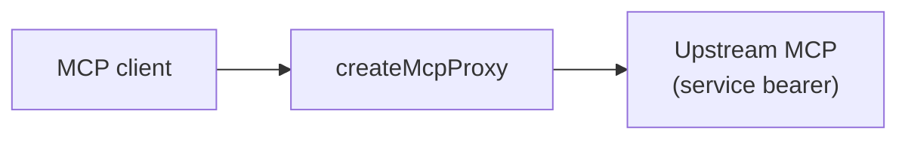

import { Aside, CardGrid, LinkCard } from '@astrojs/starlight/components';

When you cannot reach the upstream server's code, `createMcpProxy` from
`mcp-authz/proxy` is the enforce-only edge: verify each person's bearer token,
run your policy, filter catalogue listings, and forward permitted calls with a
service credential.



<Aside type="note">

Proxy mode is opt-in. Import `mcp-authz/proxy` — it is not re-exported from the
main entry.

</Aside>

## Record → price → proxy

The permission map must name every upstream capability. Record it once with a
service credential, price the entries, then point the proxy at the same map:

```bash
npx mcp-authz record \
  --upstream https://vendor.example.com/mcp \
  --token "$UPSTREAM_TOKEN" \
  --out permissions.ts
```

The generated file carries `PERMISSIONS`, a `FINGERPRINTS` baseline, and — when
the upstream serves resources — a `RESOURCE_URIS` map. Pass that third export to
the proxy as `resourceUris`: a `resources/list` names a resource, but a
`resources/read` names a URI, so pricing a read needs both. The proxy refuses to
boot if a priced `resource:` label has no URI, rather than advertising a resource
it would then refuse to read.

See [Building the permission map](/mcp-authz/typescript/permission-map/) for
`--check` drift detection in CI.

## `createMcpProxy`

```ts
import { createMcpProxy } from 'mcp-authz/proxy';
import { definePolicy } from 'mcp-authz';
import { PERMISSIONS, RESOURCE_URIS } from './permissions';

const policy = definePolicy({
  roles: { reader: ['cases:read'], editor: ['cases:read', 'cases:write'] },
  rules: [{ match: { domain: 'acme.com' }, role: 'reader' }],
});

export default createMcpProxy({
  resourceServerUrl: new URL('https://mcp.acme.com/mcp'),
  oauthMetadata: {
    issuer: 'https://auth.acme.com',
    authorization_endpoint: 'https://auth.acme.com/authorize',
    token_endpoint: 'https://auth.acme.com/token',
    response_types_supported: ['code'],
  },
  verifier: { jwksUri: 'https://auth.acme.com/.well-known/jwks.json' },
  policy,
  permissions: PERMISSIONS,
  resourceUris: RESOURCE_URIS,
  upstream: {
    url: 'https://vendor.example.com/mcp',
    bearer: process.env.UPSTREAM_TOKEN!,
  },
});
```

The handler is a `fetch` function. Bind it with
[`listenMcp`](/mcp-authz/typescript/api/) on Node, or export it from a Worker.

### Options

| Option                       | Purpose                                                                |
| ---------------------------- | ---------------------------------------------------------------------- |
| `resourceServerUrl`          | Public URL of the proxy (token audience)                               |
| `oauthMetadata`              | RFC 8414 metadata for your authorization server                        |
| `verifier` / `tokenVerifier` | Same verification options as `createMcpFetch`                          |
| `policy`                     | Required — maps verified identity to permissions                       |
| `permissions`                | Required flat map — same labels as `gate()` and `recordCapabilities`   |
| `resourceUris`               | Each `resource:` label to the URI or template it answers on            |
| `upstream`                   | Upstream base URL and service bearer                                   |
| `capabilityScopes`           | Optional per-capability OAuth step-up, same as embed mode              |
| `requiredScopes`             | Baseline scopes every token must carry (default `['mcp']`)             |
| `maxRequestBytes`            | Cap on a single message this buffers, either direction (default 1 MiB) |

At boot the proxy reconciles `permissions` against `policy.roles`, validates that
every `capabilityScopes` key names a priced capability, and refuses to start if a
priced resource carries no URI to match reads against.

## What the proxy enforces

The proxy shares the same request ladder as
[`createMcpFetch`](/mcp-authz/typescript/api/):

1. Bearer verification
2. Policy → principal
3. Classify the MCP method
4. Permission check (flat map)
5. Scope step-up (when configured)
6. Forward to upstream

| MCP method                                                                 | Listing filter                                | Invoke gate                |
| -------------------------------------------------------------------------- | --------------------------------------------- | -------------------------- |
| `tools/list`, `prompts/list`, `resources/list`, `resources/templates/list` | Yes — hidden entries match `gate()` semantics | Baseline auth only         |
| `tools/call`, `prompts/get`, `resources/read`                              | —                                             | Full ladder before forward |
| `initialize`                                                               | —                                             | Baseline auth only         |
| GET (SSE)                                                                  | —                                             | Stream pass-through        |

Absence from a listing is not the security boundary. Naming a hidden capability
still hits the permission gate and is refused before the upstream runs.

`resources/read` is priced by URI, matched against `resourceUris`, because that
is what the request carries. A URI no priced resource covers is refused, so a
template that stops covering a URI closes access rather than opening it.

Where **several patterns cover one URI**, all of them apply: the caller needs
every matching permission, and every matching step-up scope. Which registration
an upstream routes a URI to is the upstream's business, and guessing it from the
order of your permission map is how a broad readable template ends up authorizing
a narrow privileged one.

`capabilityScopes` keys resources by **label** here — `resource:case` — matching
the permission map. (Embed mode keys them by the registered URI, because that is
what its registrations are keyed by.)

A listing this cannot read is refused with a 502 rather than passed through: an
unfiltered catalogue is the full catalogue. That covers an unexpected content
type and a body that is not JSON-RPC. SSE listings are filtered event by event as
they arrive, rather than buffered to the end, so a slow upstream cannot hold a
catalogue hostage or decide how much memory this process spends.

### The proxy is stricter than embed mode

`createMcpFetch` leaves a malformed or legacy-shaped request to the SDK
underneath it, which refuses the request a second way. A proxy has no such
second line: nothing downstream re-checks anything, and forwarding is done on a
service credential that outranks the caller. So the proxy decides for itself.

- Routing headers that **disagree with the body** are an HTTP 400. A
  `Mcp-Method: tools/list` header over a `tools/call` body is a smuggling
  attempt, not a hint, and it never reaches the upstream.
- Requests carrying **no** 2026 routing headers are authorized from the JSON-RPC
  body alone, which is what the upstream will act on. Headers are never the
  source for a permission.
- A capability the map does not price is refused. An upstream that grows a tool
  after you recorded it does not inherit your service credential, and drift
  detection in CI is how you find out it grew one.

Per-capability **scopes** still require the cross-checked 2026 form, because a
scope is chosen from a name and that choice has to be defensible against a
caller who picked the headers.

<Aside type="caution" title="maxRequestBytes is load-bearing here">

Every POST is read to find the capability it names, so a body over
`maxRequestBytes` is refused with a 413 — even if the upstream would have
accepted it. In embed mode that cap only applies once per-capability scopes are
configured; in proxy mode it always applies, because nothing else can price the
call.

It bounds the **response** side too. A catalogue has to be held whole to be
filtered, whether it arrives as one JSON body or as an SSE event, so anything
over the cap is refused rather than buffered — otherwise a broken or hostile
upstream decides how much memory this process spends. The limit is counted in
bytes on both sides. Raise it if your upstream takes large tool arguments or
returns large catalogues.

</Aside>

## What the proxy forwards

The caller's `Authorization` is replaced with the upstream service credential,
and the caller's `Cookie` is dropped along with the hop-by-hop headers — those
are credentials for _this_ proxy, and the upstream was never their audience.
Everything else passes through.

`/health` reports counts, never names, and never the upstream's address: enough
to tell an operator the policy loaded and matches the map, without handing an
unauthenticated scanner a diagram of what sits behind.

## Example

The [proxy example](https://github.com/jagreehal/mcp-authz/tree/main/apps/proxy-example)
shows local Node dev and Cloudflare Workers deployment.

<CardGrid>
  <LinkCard title="Deployment" href="/mcp-authz/concepts/deployment/" />
  <LinkCard title="Building the permission map" href="/mcp-authz/typescript/permission-map/" />
  <LinkCard title="Run the embed example" href="/mcp-authz/run-the-example/" />
</CardGrid>
