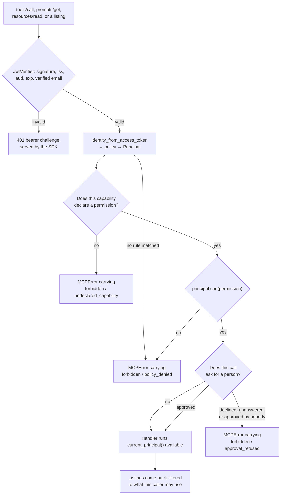

# mcp-authz (Python)

**Give an MCP server per-user permissions without deploying an authorization
system.**

Authorization for servers built with the official MCP Python SDK v2. It uses
the SDK's `MCPServer`, `TokenVerifier`, `AccessToken`, `AuthSettings`, and
server-middleware interfaces rather than replacing the protocol stack.

People sign in through your authorization server, a policy decides which
permissions they hold, and each capability declares the permission it needs. A
caller only ever sees the capabilities they may use.

## Where it fits

Use it when you own the server's source and the callers are people who already
sign in somewhere. Dana reads cases, Alice also writes them, and that decision
sits next to the handler running the query. You install a dependency, and you
run nothing new.

Plenty of good tools solve the neighbouring problems. Take one of them when its
row describes you:

| Approach                       | Example          | What you take on                                                       |
| ------------------------------ | ---------------- | ---------------------------------------------------------------------- |
| MCP gateway                    | agentgateway     | A data-plane component to deploy and keep available                    |
| Gateway plus policy service    | Permit           | The gateway, and the policy infrastructure behind it                   |
| External decision point        | Cerbos           | A PDP to run, and a call out to it on every decision                   |
| Relationship-based permissions | Auth0 FGA        | Richer rules than this offers, in a second authorization system        |
| Framework feature              | FastMCP          | Per-component checks, and the framework they come with                 |
| OAuth plumbing                 | the official SDK | Authentication and resource-server mechanics, with no permission model |
| Embedded dependency            | **mcp-authz**    | One package, and a policy engine that stays small by design            |

Two cases need none of this. A stdio server on one laptop already has the OS
account as its boundary. A server where every caller gets identical access wants
one service credential and no policy. URL-only servers need a gateway. Rich
relationship rules belong in Cerbos or FGA; call them from your own code rather
than growing this policy engine.

### Servers you did not write

If you can wrap the builder that constructs an `MCPServer`, `gate()` puts a
permission map over tools that were never declared with one:

```python
from mcp_authz import gate

server = their_builder(
    wrap=lambda s: gate(s, principal, {
        "get_case": "testrail:read",
        "delete_run": "testrail:delete",
    }),
)
```

Undeclared registrations raise. Unpermitted tools and prompts are removed from
listings; unpermitted resources are never registered. Full detail in the
[Python gate guide](https://jagreehal.github.io/mcp-authz/python/gate/).

FastMCP is the closest alternative that also runs in your process. It filters
components with a callable per component, which suits a rule that lives in one
place. This puts the rules in one declarative policy instead, checks the
capability catalogue against it at startup, and runs on the official SDK rather
than a framework of its own.

Writing the server in TypeScript? [`mcp-authz` on npm](https://www.npmjs.com/package/mcp-authz)
makes the same decisions on the TypeScript SDK.

## Install

```bash
pip install mcp-authz
```

Requires Python 3.10 or newer. CI covers 3.10, 3.12 and 3.13.

## Quick start

```python
from mcp.server.auth.settings import AuthSettings
from mcp_authz import AuthorizedMCPServer, JwtVerifier, define_policy

policy = define_policy({
    "roles": {
        "reader": ["cases:read"],
        "editor": ["cases:read", "cases:write"],
    },
    "rules": [
        {"match": {"domain": "acme.com"}, "role": "reader"},
        {"match": {"email": "alice@acme.com"}, "role": "editor"},
    ],
})

server = AuthorizedMCPServer(
    "cases",
    policy=policy,
    token_verifier=JwtVerifier(
        issuer="https://auth.acme.com",
        jwks_uri="https://auth.acme.com/.well-known/jwks.json",
        resource="https://mcp.acme.com/mcp",
    ),
    auth=AuthSettings(
        issuer_url="https://auth.acme.com",
        resource_server_url="https://mcp.acme.com/mcp",
        required_scopes=["mcp"],
    ),
)

@server.tool(permission="cases:read")
def get_case(case_id: str) -> dict[str, str]:
    return {"id": case_id}

app = server.streamable_http_app(stateless_http=True)
```

`resource_server_url` must be the URL clients actually reach. Advertise
anything else and a conforming client will not attach its token to a resource
it was not issued for.

## Point your authorization server at it

Four steps, in order. Step 2 is the one people skip, and its failure is the
confusing kind: the client completes the whole OAuth flow, receives a valid
token, and then never sends it.

1. **Settle the public URL.** `resource_server_url` and the verifier's
   `resource` both have to be the URL clients dial, path and all. The SDK
   publishes RFC 9728 metadata naming it. A client that reads a different host
   there declines to attach its token, and nothing in the logs says "wrong host".

2. **Register that URL at your AS as a resource identifier, with RFC 8707
   resource indicators enabled.** The client sends
   `resource=https://mcp.acme.com/mcp`, and your AS has to mint a token whose
   `aud` equals it. Auth0 models this as an API with an audience; WorkOS and
   Stytch expose it as the MCP resource server settings. Without it you get a
   perfectly signed token that `JwtVerifier` refuses.

3. **Define the baseline scope** you pass to `AuthSettings.required_scopes`,
   usually `mcp`, and grant it to the client.

4. **Check the claims your rules need.** `iss`, `sub`, `aud` and `exp` are
   always required. Any `email` or `domain` rule also needs `email` and
   `email_verified: true`. A Workspace `domain` rule reads `hd`, so the AS has
   to pass it through from Google.

Unlike the TypeScript package, nothing here discovers AS metadata for you. Give
`JwtVerifier` the `issuer` and `jwks_uri` directly, then add
`https://mcp.acme.com/mcp` in Claude as a custom connector and sign in.

### When it does not work

| Symptom                                                | Cause                                                               |
| ------------------------------------------------------ | ------------------------------------------------------------------- |
| Login succeeds, then the client never attaches a token | `resource_server_url` is not the URL the client dialled (step 1)    |
| 401 on every call, signature verifies fine             | `aud` is not your MCP URL (step 2), or `iss` does not match         |
| 401 for some people only                               | `email_verified` missing or false, or `hd` outside `allowed_domain` |
| Capability missing from a listing                      | The principal lacks its permission. Working as designed             |
| `forbidden/policy_denied` on a direct call             | Same cause, reached by name instead of by listing                   |
| `forbidden/policy_denied` on every call, listings too  | The caller matched no rule, so they hold nothing. By design         |
| `forbidden/undeclared_capability`                      | Registered on `.mcp` directly, so no permission prices it           |
| `forbidden/approval_refused`                           | A person declined, said nothing in time, or approved without a name |

## `define_policy(spec)`

The spec is a plain mapping, so the same shape works written in code, parsed
from `MCP_POLICY`, or loaded from YAML you read yourself. The package never
touches the environment or the filesystem.

```python
policy = define_policy({
    "permissions": ["cases:read", "cases:write"],
    "roles": {"reader": ["cases:read"], "admin": ["*"]},
    "rules": [
        {"match": {"domain": "acme.com"}, "role": "reader"},
        {"match": {"claim": {"org.groups": "qa-leads"}}, "role": "admin"},
        {"match": {"sub": "auth0|left-last-march"}, "deny": True},
    ],
})
```

Rules match on `issuer`, `sub`, `email`, `domain`, or any verified `claim`.
Claim paths are dotted, a scalar must equal, and a list must contain. Every
matching rule applies and the permissions union. One `deny` match beats all of
them.

**Matching no rule means no permissions**, and no setting changes that. A
default that can be widened eventually is, and the failure is silent.

Email and domain rules match only when the token carried a verified email.
`domain` falls back to the part after `@` when the issuer passes no `hd` claim.
Stable identities are the pair `(issuer, sub)`, so name `issuer` in a rule when
one policy accepts identities from more than one issuer.

Declaring the optional `permissions` catalogue makes a role that grants an
unlisted permission fail validation, which keeps a wildcard-only policy honest.
The whole shape is validated when you call `define_policy`: unknown fields,
empty role names, a rule granting nothing, and a role that no `roles` entry
defines all raise `ValueError` before the server starts.

## Capabilities

Tools, prompts, and resources go through the same gate:

```python
@server.tool(permission="cases:write")
def update_case(case_id: str, title: str) -> dict[str, str]: ...

@server.prompt(permission="reports:generate")
def release_report(version: str) -> str: ...

@server.resource("case://{case_id}", permission="cases:read")
def case(case_id: str) -> str: ...
```

A caller without the permission never sees the capability in `tools/list`,
`prompts/list`, `resources/list`, or `resources/templates/list`. Skipping the
listing and calling the name directly earns an MCP error carrying
`{"error": "forbidden", "reason": "policy_denied"}` with the permission and
capability that failed. Templated resource URIs match by template, so
`case://C1234` is checked against `case://{case_id}`.

A capability nobody priced is refused too, with
`{"error": "forbidden", "reason": "undeclared_capability"}`, and hidden from
every listing. `AuthorizedMCPServer` exposes the underlying `.mcp`, so a tool
registered straight on it skips the decorator that would have priced it, and
denying by default is what stops that becoming a tool reachable by everyone with
nothing in the logs to read.



`AuthorizationMiddleware` does all of it, so the check sits in the SDK's own
middleware chain rather than inside your handlers.

## Human approval

Some actions want a second person even when the caller is permitted:

```python
async def ask_in_slack(request: ApprovalRequest) -> ApprovalDecision:
    reply = await slack.ask("#ops", request)  # who, what, and the arguments
    return ApprovalDecision(True, by=reply.user) if reply.ok else ApprovalDecision(False, reason=reply.text)

server = AuthorizedMCPServer(..., on_approval=ask_in_slack, approval_timeout=45.0)

@server.tool(permission="cases:delete", approval=lambda args: args.get("force") is True)
def delete_case(case_id: str, force: bool = False) -> None: ...
```

`approval` is `True` for every call, or a predicate over the arguments when only
some of them warrant it. `ApprovalDecision(True)` raises without `by`, and an
approval that reaches the middleware naming nobody is refused there too: an
approval no name is on is not a second pair of eyes, and an adapter parsing a
reply from a chat tool can always hand you one.

This is not the permission check repeated. The caller already holds
`cases:delete`. It is also the one check that cannot be a decision about
visibility, because it turns on arguments that do not exist until the call, so
an approval-gated capability stays listed and is refused on invocation with
`{"error": "forbidden", "reason": "approval_refused"}`.

**Silence is a refusal**, after `approval_timeout` seconds. Keep it under the
idle timeout of whatever proxy sits in front. An approver that raises refuses
too, rather than letting the action through on the strength of a Slack outage.
Declaring `approval` with no `on_approval` fails at registration.

Nothing here is durable, and it does not need to be: the caller is still on the
other end of an open request, so a process that dies mid-question takes the
request with it and the action correctly did not happen. For approval that
outlives the request, keep the same seam: write a pending row from
`on_approval`, return a refusal naming the ticket, and add a tool of your own
that polls it. The store lives in your application, and this stays something you
install rather than something you run.

## Where the audit events go

The downstream API sees one service account. These events are the only record
tying a person to an action, so they are worth sending somewhere a security team
already looks. There is no sink to configure and no adapter to install: each
hook is a callable, sync or async, and the useful ones are one line.

```python
server = AuthorizedMCPServer(
    "cases",
    policy=policy,
    token_verifier=verifier,
    auth=auth,
    on_audit=lambda event: log.info("audit", extra=event.to_dict()),
    on_decision=lambda event: log.warning("access", extra=event.to_dict()),
)
```

**Wire both.** `on_audit` sees calls that were permitted: `attempt`, then
`success`, `failure` or `refused`, with identity, capability, permission,
timestamp and duration. `on_decision` sees the refusals — including somebody
naming a capability they were never shown, which is the single most interesting
line in the whole log.

**Keep third-party HTTP off the hot path.** The `attempt` write is awaited, and
its failure stops the call before it runs — that is what makes the trail
fail-closed, and it means a webhook here puts somebody else's uptime in front of
your tools. Write locally, ship asynchronously. A terminal write happens after
the action reached its result, so its failure cannot change that result; set
`on_audit_error` to send the event and the error to your retry queue.

`gate` takes `on_audit` and `on_audit_error` too, which is the only record tying
a person to an action when the tools were written by somebody else.

**Three fields exist for the reader, not the caller.** `call_id` is the same on
both events of one call and different for every other, so a store can join an
attempt to its outcome without guessing from timestamps. `domain` is the
verified Workspace domain — the nearest thing to an organisation this can prove,
so key one by `(issuer, domain)`. `emitter` names the deployment, and it is
the one you have to set yourself:

```python
AuthorizedMCPServer("cases", ..., emitter="cases-prod", on_audit=..., on_decision=...)
McpProxy(..., emitter="cases-prod", on_decision=...)
```

Set the same value in every entry point of one deployment, or a reader cannot
tell that a refusal and a call came from the same place. Left unset the field is
absent rather than guessed. With those three, "what does this org use, and who
used it" is a group-by rather than a schema migration.

**Every event says what it is.** `mcp_authz.audit.v1` and `mcp_authz.decision.v1`
share half their fields and land in the same store, often for years, so each
carries its own `type`. `event.to_dict()` is the wire form, and it emits the
same JSON keys as the TypeScript package — one query covers a deployment running
both. A [conformance fixture](https://github.com/jagreehal/mcp-authz/tree/main/conformance/v1/audit)
pins those keys in both languages. A new optional field does not move the `v1`;
changing what an existing field means does.

## `mcp_authz.openapi` — the same bet on an HTTP API

An OpenAPI document is the other catalogue an agent reads. A tool that is never
registered is a tool the model never sees; an operation that is never in the
served document is an operation the agent never calls. Same policy, same audit
events, keyed on `operationId` instead of a tool name.

```python
from mcp_authz.openapi import OpenApiAuthorizationMiddleware, record_operations, to_permissions_module

# The map, generated from the document rather than written by hand:
# print(to_permissions_module(record_operations(spec)))

app = OpenApiAuthorizationMiddleware(
    api,                       # any ASGI app: FastAPI, Starlette, Litestar, Django
    spec=spec,
    permissions=PERMISSIONS,   # {"getCase": "cases:read", "deleteCase": "cases:delete", ...}
    policy=policy,
    token_verifier=JwtVerifier(issuer=..., jwks_uri=..., resource="https://api.acme.com"),
    resource_server_url="https://api.acme.com",
    authorization_servers=["https://auth.acme.com"],
    on_audit=lambda event: log.info("audit", extra=event.to_dict()),
)
```

Dana fetches `/openapi.json` and gets three read operations. Alice fetches the
same path and gets the write and the delete too. Dana calling `DELETE
/cases/C1234` anyway is refused with the permission she lacks — the smaller
document was a context saving, never the boundary.

**Anything the document does not describe is refused**, with a 404 that says so.
That is the same rule as `gate`: a capability nobody priced is reachable by
everyone or by nobody, with no error to read. Routes you deliberately keep out of
the spec — a health check, static files — belong outside this wrapper rather than
behind it.

`record_operations(spec)` needs the document and nothing else: no running server,
no introspection, and it refuses an operation with no `operationId`, because a
generated fallback name is a second naming scheme that changes under a path
rename. Construction fails on an operation the map does not price, on a map entry
naming an operation the document no longer has, and on a permission no role
grants.

Audit events are the ones above, with `kind="operation"`, the `operationId` as
`name` and the concrete path as `resource`, so one query covers both surfaces of
the same product.

## `mcp_authz.proxy` — a server you can only reach by URL

`AuthorizedMCPServer` needs the tools; `gate` needs the builder that makes them.
When all you have is an address, there is no in-process seam left, and
enforcement happens at the edge:

```python
from mcp_authz.proxy import McpProxy

app = McpProxy(
    resource_server_url="https://mcp.acme.com/mcp",
    upstream_url="https://vendor.example.com/mcp",
    upstream_bearer=lambda: os.environ["VENDOR_TOKEN"],   # or a str
    policy=policy,
    token_verifier=JwtVerifier(issuer=..., jwks_uri=..., resource="https://mcp.acme.com/mcp"),
    permissions=PERMISSIONS,      # {"get_case": "cases:read", "resource:cases": "cases:read", ...}
    resource_uris=RESOURCE_URIS,  # {"resource:cases": "cases://all", ...}
    authorization_servers=["https://auth.acme.com"],
    on_decision=lambda event: log.warning("access", extra=event.to_dict()),
)
```

It is an ASGI app: run it under uvicorn, or mount it in whatever already serves
your other routes.

**Nothing downstream re-checks anything.** The upstream is reached with one
service credential that outranks every caller, so this fails closed three ways
the in-process seams do not have to:

- a request whose routing headers disagree with its body is refused, not
  forwarded — one of the two is lying about what it does, and neither answer can
  be trusted over the other
- an invocation the permission map does not price is refused, so a tool the
  upstream added after the map was written inherits nothing
- a catalogue this cannot read — wrong content type, over the byte cap,
  unparseable — is withheld with a `502` rather than passed through, because a
  listing served unfiltered hands every caller the map

Listings are filtered on the way back, over JSON and over SSE, event by event as
they arrive rather than buffered: the body is an upstream's to size, and holding
it whole would let that upstream decide how much memory this process spends.

`resources/read` names a URI on the wire and a label in the permission map, so
`resource_uris` maps each priced `resource:` label to the URI or template it
answers on. Where several templates cover one URI, every one of their permissions
must be satisfied — which registration the upstream routes a URI to is its
business, not something to guess from the order of a map. A priced resource with
no URI fails at construction rather than at the first read.

## Boot-time reconciliation

Decorating a capability with a permission that no role grants raises
`ValueError` at import time, naming the capability:

```
Capability 'delete_case' requires 'cases:delete', but no policy role grants it.
```

A permission that no capability requires only warns, and it warns when you
build the app rather than at import. Granting a role ahead of the tool that
will use it is how a staged rollout works, so that case stays a warning.

## `policy.explain(identity)`

The decision tells you what Alice may do. It cannot tell you why, and why is
what gets asked when somebody is surprised.

```python
explanation = policy.explain(identity)

for rule in explanation.matched:
    print(rule.index, dict(rule.match), rule.roles)   # 0 {'domain': 'acme.com'} ('reader',)

explanation.principal.permissions                     # ('cases:read', 'cases:write')
explanation.denied_by                                 # the deny that emptied the grant, or None
```

Each `MatchedRule` carries its index in your own `rules` list, so the answer
points at the entry an administrator edits. It shares the one matcher with the
decision, so the two can never disagree. Nothing in the middleware calls it.

For a policy kept as JSON, the npm package ships a CLI that reads the same file
and prints the same derivation, which saves writing a script:

```bash
npx mcp-authz explain policy.json --identity alice.json
```

## Inside a handler

```python
from mcp_authz import current_principal

@server.tool(permission="cases:read")
def list_cases() -> list[dict[str, str]]:
    principal = current_principal()
    return query_cases(tenant=principal.domain, include_drafts=principal.can("cases:write"))
```

| Field             | What it holds                                                  |
| ----------------- | -------------------------------------------------------------- |
| `issuer`          | Exact token issuer; key durable identity with `sub`.           |
| `sub`             | Token subject, unique only within its issuer.                  |
| `email`           | Verified email when the issuer supplies one.                   |
| `domain`          | Workspace domain, or the email's domain as a fallback.         |
| `roles`           | Names of the roles that matched.                               |
| `permissions`     | What those roles grant.                                        |
| `can(permission)` | Honours a `*` grant, so ask this instead of reading the tuple. |

The package checks the permission the capability declared. Your handler uses
the principal to constrain its own domain query, which is the part no proxy can
do for you. Calling `current_principal()` outside a request raises
`RuntimeError`.

## `JwtVerifier`

| Option                   | Purpose                                                        |
| ------------------------ | -------------------------------------------------------------- |
| `issuer`                 | Expected `iss`, checked on every token                         |
| `jwks_uri`               | Signing keys, cached by the client                             |
| `resource`               | Expected `aud`, your public MCP URL, fragment stripped         |
| `allowed_domain`         | Optional. Refuse tokens whose `hd` is another Workspace        |
| `email_claim`            | Claim holding the email. Default `email`                       |
| `email_verified_claim`   | Provider-specific assurance claim. Default `email_verified`    |
| `require_email_verified` | Default `True`. Turn it off only when the issuer guarantees it |
| `algorithms`             | Default `("RS256", "ES256")`. HMAC algorithms are refused      |

It checks signature, issuer, audience, expiry, a stable subject, and a verified
email, then returns the SDK's `AccessToken`. An invalid credential returns
`None`, which is what the SDK expects, so the standard bearer challenge goes
back to the client. Verification runs in a worker thread and leaves the event
loop free.

For opaque tokens or an introspection endpoint, pass any SDK-compatible
`TokenVerifier` instead. As long as it fills `claims` with `iss`, `sub`, and a
verified email, `identity_from_access_token` maps it into the policy identity
unchanged.

## Scopes

The official Python SDK currently exposes only global HTTP scope requirements.
`AuthSettings.required_scopes` therefore enforces the baseline scope, while
per-capability permissions control discovery and invocation. The shared routing
and scope helpers (`classify_scoped_request`, `scopes_for_capability`,
`decode_mcp_name_header`) pin the intended step-up behavior, but this package
does not double-verify tokens or patch private SDK routes to manufacture
transport-level per-capability challenges.

Scopes and permissions stay separate axes either way. A scope gap is something
the client can fix by re-authorising. A permission gap is an administrator's
job.

## What this does not have

The npm package ships an `mcp-authz` binary that explains a decision and
reconciles a policy from a terminal. There is no Python equivalent, and there
may never need to be: it reads a JSON policy file, so it already works on yours.

Per-capability OAuth scope step-up is npm-only too, for the reason given under
[Scopes](#scopes) — including inside `mcp_authz.proxy`, which enforces
permissions but not step-up. So is `record_capabilities`, which reads a
permission map off a running MCP server; `record_operations` covers the OpenAPI
half of that here, and until the MCP half lands you list an upstream once with
`mcp.client.Client` and price what it returns.

Policy decisions, audit events and access decisions stay identical across the
two languages, which is what the conformance fixtures pin.

## Conformance

The package runs the same language-neutral policy, scope, and routing fixtures
as the TypeScript `mcp-authz`, which stops the two implementations from
drifting. See [`conformance/`](https://github.com/jagreehal/mcp-authz/tree/main/conformance)
for the fixtures and what a change to them means.

## Example

A runnable server, including the token claims your authorization server has to
issue, is in [`apps/python-example`](https://github.com/jagreehal/mcp-authz/tree/main/apps/python-example).

## License

MIT
