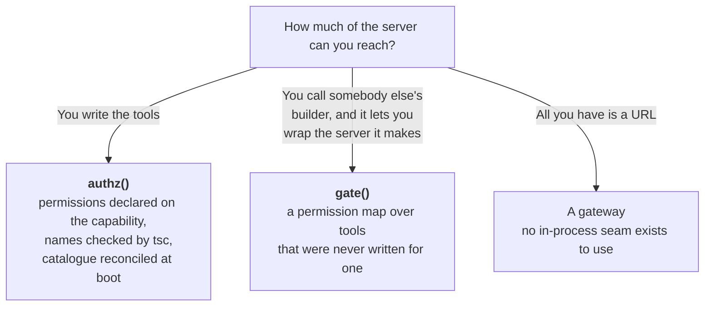
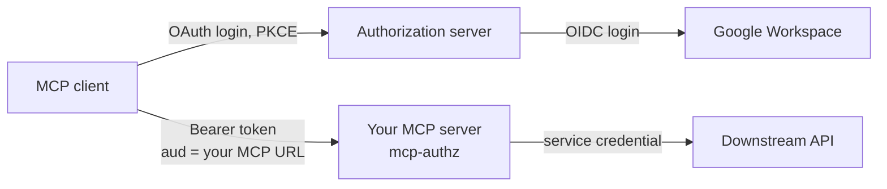
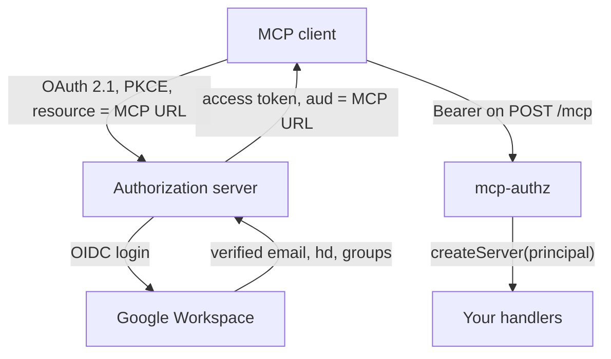
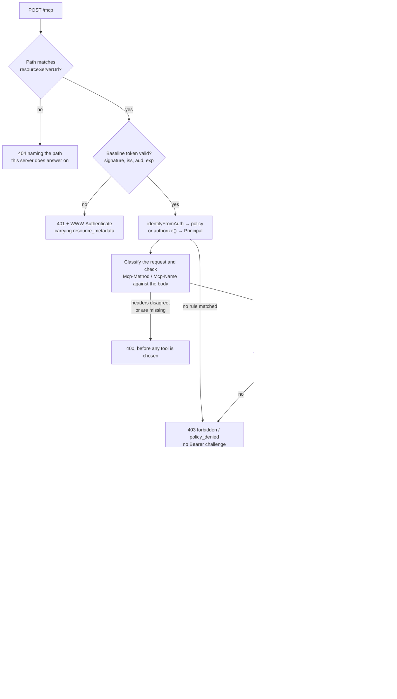

# mcp-authz

**Give an MCP server per-user permissions without deploying an authorization system.**

A remote MCP **resource server** you put behind Claude (or any MCP client that speaks OAuth). People sign in through your authorization server; a policy decides which permissions they hold; MCP capabilities declare the permission they need, and a caller only ever sees the ones they may use.

This package is the generic shell. Wire TestRail, Jira, Help Scout, or anything else behind it. The downstream service keeps its single service credential, and this decides which person may make it do what.

## Where it fits

Use it when you can reach the server's code, or wrap the builder that makes it, and the callers are people who already sign in somewhere. Dana reads cases, Alice also writes them, and that decision sits next to the handler running the query. You install a dependency, and you run nothing new.

Plenty of good tools solve the neighbouring problems. Take one of them when its row describes you:

| Approach                       | Example                | What you take on                                                       |
| ------------------------------ | ---------------------- | ---------------------------------------------------------------------- |
| MCP gateway                    | agentgateway           | A data-plane component to deploy and keep available                    |
| Gateway plus policy service    | Permit                 | The gateway, and the policy infrastructure behind it                   |
| External decision point        | Cerbos                 | A PDP to run, and a call out to it on every decision                   |
| Relationship-based permissions | Auth0 FGA              | Richer rules than this offers, in a second authorization system        |
| Framework feature              | FastMCP                | Convenience, tied to that framework                                    |
| OAuth plumbing                 | official SDK, mcp-auth | Authentication and resource-server mechanics, with no permission model |
| Embedded dependency            | **mcp-authz**          | One package, and a policy engine that stays small by design            |

Two cases need none of this. A stdio server on one laptop already has the OS account as its boundary. A server where every caller gets identical access wants one service credential and no policy.

### You need one integration seam

Which one you get decides the tool, and the source is not the only seam that
works.



The middle rung is the one people miss. A package you install, whose tools you
did not write, still works here as long as its builder hands you the server
before returning it. That hook is two lines, it is worth asking an upstream
maintainer for, and [`gate()`](#gateserver-principal-permissions) shows both
sides of it. Without the hook nothing in this package can help: the SDK keeps a
built server's tool list private, so no code can filter what it never saw.

Writing the server in Python? [`mcp-authz` on PyPI](https://pypi.org/project/mcp-authz/) makes the same decisions on the official Python SDK.

### FastMCP and `canAccess`

FastMCP gates a capability with a predicate:

```ts
canAccess: requireRole('admin');
canAccess: (auth) => auth?.role === 'admin' && auth?.department === 'engineering';
```

That runs, and for one rule in one place it is the right amount of machinery.

A predicate carries no vocabulary. TypeScript cannot derive the permission names from it, startup cannot compare the tools against the roles, and each closure agrees with the others only because you kept them in step by hand. `definePolicy` hands you one object that the compiler reads and that boot reconciles:

- `permission: 'cases:wrtie'` fails `tsc` rather than a request at 3am.
- A tool requiring `cases:delete` that no role grants refuses to boot.
- An administrator edits one file instead of eleven closures.

Twenty tools sharing a vocabulary is where this pays. One tool with one rule is where it does not.

## Deployment

You ship one MCP server process with this library inside it. Claude dials your
public URL. Your authorization server runs login. TestRail or Jira keeps one
service credential. Full stack detail is in the
[docs](https://jagreehal.github.io/mcp-authz/concepts/deployment/).



## Who does what



**We are a resource server, and nothing more.** Verifying tokens is ours.
Registering Claude, showing consent and running PKCE belongs to an authorization
server that already exists. Google cannot fill that role itself: it has no
client registration for your MCP audience, and it will not mint a token whose
audience is your MCP endpoint. WorkOS, Stytch and Auth0 all do both halves,
including Google Workspace login.

## What a request goes through



Three orderings in there are deliberate. Authentication precedes the body read,
so nobody who cannot present a valid token can make this process parse anything.
Header validation precedes both the permission lookup and scope selection, so an
untrusted `Mcp-Name` can talk its way into neither a cheaper scope nor another
capability's permission. Permission precedes scope, so an unpermitted caller is
never prompted to re-authorise for an action your policy will refuse anyway.

## Install

```bash
pnpm add mcp-authz @modelcontextprotocol/server
# optional Node helper:
pnpm add @modelcontextprotocol/node
```

Requires Node.js 24 or newer.

## Point your authorization server at it

Five steps, in order. Step 2 is the one people skip, and its failure is the
confusing kind: the client completes the whole OAuth flow, receives a valid
token, and then never sends it.

1. **Settle the public URL.** `resourceServerUrl` has to be the URL clients
   dial, path and all. The library publishes RFC 9728 metadata at
   `/.well-known/oauth-protected-resource/mcp` for an `/mcp` path and names that
   same URL as `resource`. A client that reads a different host there declines
   to attach its token, and nothing in the logs says "wrong host".

2. **Register that URL at your AS as a resource identifier, with RFC 8707
   resource indicators enabled.** The client sends
   `resource=https://mcp.acme.com/mcp`, and your AS has to mint a token whose
   `aud` equals it. Auth0 models this as an API with an audience; WorkOS and
   Stytch expose it as the MCP resource server settings. Without it you get a
   perfectly signed token that this library refuses with 401.

3. **Define the scopes.** The baseline is whatever you pass to `requiredScopes`
   (default `mcp`), plus one scope for each entry in `toolScopes` or
   `capabilityScopes`, such as `write`. Grant them to the client. The library
   advertises the full set as `scopes_supported` in the resource metadata.

4. **Decide how clients register.** Prefer an AS that supports CIMD. If yours
   only offers DCR, publish `registration_endpoint` in `oauthMetadata`, and
   treat it as a stopgap: DCR is deprecated in this protocol revision.

5. **Check the claims your rules need.** `iss`, `sub`, `aud` and `exp` are
   always required. Any `email` or `domain` rule also needs `email` and
   `email_verified: true`. A Workspace `domain` rule reads `hd`, so the AS has
   to pass it through from Google.

Then hand the library the issuer and let it read the rest:

```ts
const fetch = createMcpFetch({
  resourceServerUrl: new URL(process.env.MCP_PUBLIC_URL!),
  oauthMetadata: await discoverOAuth(process.env.OAUTH_ISSUER!),
  policy,
  createServer,
});
```

Add `https://mcp.acme.com/mcp` in Claude as a custom connector and sign in.

### When it does not work

| Symptom                                                | Cause                                                                        |
| ------------------------------------------------------ | ---------------------------------------------------------------------------- |
| Login succeeds, then the client never attaches a token | `resourceServerUrl` is not the URL the client dialled (step 1)               |
| 401 on every call, signature verifies fine             | `aud` is not your MCP URL (step 2), or `iss` does not match                  |
| 401 for some people only                               | `email_verified` missing or false, or `hd` outside your Workspace            |
| 403 `forbidden/policy_denied`                          | The token is fine and no rule matched. Working as designed                   |
| 403 `insufficient_scope`                               | Permission granted, token lacks the capability's scope. Client re-authorises |

## API

### `createMcpFetch(options)`

Returns `(request: Request) => Promise<Response>`.

| Option              | Purpose                                                        |
| ------------------- | -------------------------------------------------------------- |
| `resourceServerUrl` | Public URL Claude reaches, e.g. `https://mcp.acme.com/mcp`     |
| `oauthMetadata`     | Your AS's RFC 8414 fields, or `await discoverOAuth(issuer)`    |
| `verifier`          | Built-in JWT/JWKS verification and claim options               |
| `tokenVerifier`     | Custom SDK verifier, including opaque-token introspection      |
| `identityFromAuth`  | Map custom `AuthInfo` to an `Identity`                         |
| `requiredScopes`    | Baseline scopes (default `['mcp']`)                            |
| `toolScopes`        | Declarative tool name → scope(s) for safe step-up              |
| `capabilityScopes`  | Tools, prompts and resource URIs → scope(s)                    |
| `supportedScopes`   | Additional scopes advertised in resource metadata              |
| `scopesForRequest`  | Advanced `(request, trustedRoute) => scopes` resolver          |
| `policy`            | `definePolicy(...)`; matching no rule is HTTP 403              |
| `authorize`         | Async alternative to `policy` for external entitlements        |
| `resolve`           | Optional: `(identity, principal) => context` to enrich context |
| `onDecision`        | Awaited allow/deny decision sink                               |
| `createServer`      | `(context) => McpServer` once per request; see `authz`         |
| `permissions`       | Optional: the boot-time map, when a factory of yours hides it  |
| `maxRequestBytes`   | Cap on the post-auth body read that names a capability. 1 MiB  |
| `legacy`            | 2025 handling; strict `reject` by default                      |

**`legacy` needs care.** The SDK client 2.0.0 still opens with an `initialize` handshake, and
2026-07-28 removed it (SEP-2567) — so from this handler's side every client shipping today is a
legacy client, and the default `reject` turns all of them away. A deployment real clients must
reach wants `legacy: 'stateless'` until a client ships without the handshake. The gate applies
identically on both paths; `src/e2e.story.test.ts` drives a real client through each.

`MCP_PUBLIC_URL` / `resourceServerUrl` **must** be the URL clients actually reach. Advertise anything else and a conforming client will not attach its token to a resource it was not issued for.

### `discoverOAuth(issuer)`

```ts
oauthMetadata: await discoverOAuth('https://auth.acme.com'),
```

Reads the endpoints off the authorization server rather than out of a config file,
including `jwks_uri`, which leaves the `verifier` block optional. It tries the RFC
8414 location first and the OIDC one second, because Auth0 and Google publish only
the latter. A document declaring a different issuer is refused: its endpoints would
send your users somewhere else to sign in.

The cost is a fetch during boot. An AS that is down now stops your deploy rather
than only your logins, so keep passing `oauthMetadata` by hand if you would rather
own that trade.

The built-in JWT verifier requires `email_verified: true` by default before
email or domain rules can run. Use `verifier.emailVerifiedClaim` for a
provider-specific assurance claim, or explicitly set `requireEmailVerified:
false` only when the issuer contract guarantees the email another way. For
opaque tokens, pass any SDK-compatible `tokenVerifier` plus `identityFromAuth`.

### `definePolicy(spec)`

```ts
import { definePolicy } from 'mcp-authz';

const policy = definePolicy({
  roles: {
    reader: ['cases:read'],
    editor: ['cases:read', 'cases:write'],
    admin: ['*'],
  },
  rules: [
    { match: { domain: 'acme.com' }, role: 'reader' },
    { match: { email: 'alice@acme.com' }, role: 'editor' },
    { match: { claim: { 'org.groups': 'qa-leads' } }, role: 'editor' },
    { match: { sub: 'auth0|left-last-march' }, deny: true },
  ],
});

export type Permission = PermissionOf<typeof policy>; // 'cases:read' | 'cases:write'
```

Match on `issuer`, `sub`, `email`, `domain`, or any verified `claim` (dotted paths; a scalar
must equal, an array must contain). Every matching rule applies and the permissions
union; one `deny` match wins over all of them.

Email and domain rules match only when the identity mapper marked the email as
verified. Stable identities are the pair `(issuer, sub)`, not `sub` alone; include
`issuer` in a rule when one policy accepts identities from multiple issuers.

**Matching no rule means no permissions**, and there is no setting to change that.
A default that can be widened eventually is, and the failure is silent.

Written as a literal above, permission names become a string-literal union:

```ts
tool(
  'update_case',
  {
    permission: 'cases:wrtie',
    //          ^^^^^^^^^^^^^
    // Type '"cases:wrtie"' is not assignable to
    // type '"cases:read" | "cases:write"'.
  },
  updateCase,
);
```

Handed
`definePolicy(JSON.parse(process.env.MCP_POLICY!))` the same call still validates
the shape and still reconciles at boot. It cannot check names TypeScript
never saw. The library reads neither the environment nor the filesystem: how an
application loads configuration is the application's business.

The full runtime shape is validated at startup: catalogues, roles, permission
strings, rules, match fields and claim values. Malformed JSON cannot survive
boot and become a request-time 500.

For a wildcard-only policy, declare the concrete vocabulary so permission
names remain compile-time checked:

```ts
const policy = definePolicy({
  permissions: ['cases:read', 'cases:write'],
  roles: { admin: ['*'] },
  rules: [{ match: { email: 'admin@acme.com' }, role: 'admin' }],
});
```

### `authz(policy)`

One call binds everything to one policy. Each builder accepts only a permission that
policy can grant, so `cases:wrtie` is a build error in all three.

```ts
const { tool, prompt, resource, server } = authz(policy);

const createServer = server(
  [
    tool(
      'update_case',
      {
        permission: 'cases:write',
        inputSchema: z.object({ id: z.string(), title: z.string() }),
        audit: ({ id }) => `case:${id}`,
      },
      async ({ id, title }, { principal }) => renameCase(id, title, principal),
    ),

    // A prompt is a tool call somebody else composed, so it costs what that
    // call costs. A resource is read-only to MCP and still the whole case list.
    prompt('triage_case', { permission: 'cases:write', argsSchema }, walkThroughRename),
    resource('cases', { permission: 'cases:read', uri: 'cases://all' }, readCases),
  ],
  { name: 'acme', version: '1.0.0', onAudit: (event) => log.info(event) },
);
```

Whatever the caller lacks the permission for is **never registered**, so it is absent
from `tools/list` and there is no per-handler check to forget. Skipping the list and
naming an unregistered prompt is refused before dispatch with the same `403
forbidden / policy_denied`, and that denied attempt reaches `onDecision`. A probe
for a capability somebody was never shown is exactly the one worth having in a log.
OAuth scopes do not affect visibility: a permitted capability remains visible when
the current token needs step-up.

`onAudit` emits `attempt`, followed by `success`, `failure` or `refused`, with
identity, capability, permission, resource, timestamp and duration. The server
awaits each write. A rejected `attempt` write stops the handler before it runs.
A terminal write happens after the action has reached its result, so its failure
cannot change that result. Set `onAuditError` to send the failed event and error
to your retry queue or operator alert.

The boot-time check keys prompts and resources as `prompt:triage_case` and
`resource:cases`, so a prompt sharing a tool's name stays its own entry. A server
advertises only the kinds it actually has.

Each handler takes the tool's arguments and a context carrying the `Principal` the
policy produced:

| Field             | What it holds                                                  |
| ----------------- | -------------------------------------------------------------- |
| `issuer`          | Exact token issuer; key durable identity with `sub`.           |
| `sub`             | Token subject, unique only within its issuer.                  |
| `email`           | Verified email when the issuer supplies one.                   |
| `domain`          | Workspace domain, when the AS passes `hd` through.             |
| `roles`           | Names of the roles that matched.                               |
| `permissions`     | What those roles grant.                                        |
| `can(permission)` | Honours a `*` grant, so ask this instead of reading the array. |

A handler never checks the permission it declared, because `server` checked it before
registering. Call `can` when one handler branches on a second permission, such as
returning extra fields to an admin.

### Human approval

Some actions want a second person even when the caller is permitted. Declare it
on the capability and the call waits for an answer before it runs:

```ts
tool(
  'delete_run',
  {
    permission: 'testrail:delete',
    // `true` for every call, or a predicate when only some arguments warrant it
    approval: ({ force }) => force,
    audit: ({ id }) => `run:${id}`,
  },
  deleteRun,
);

server(definitions, {
  name: 'acme',
  version: '1.0.0',
  onApproval: async (request) => {
    const reply = await askInSlack('#ops', request); // request carries who, what, and the arguments
    return reply.ok ? { approved: true, by: reply.user } : { approved: false, reason: reply.text };
  },
});
```

`{ approved: true }` will not compile without `by`, and an approval that arrives
naming nobody is refused at runtime as well. The type is the first line and not
the only one: an adapter written in untyped code, or one handing back a JSON
reply from a chat tool, can still produce an anonymous yes, and that would run a
destructive call under an audit trail claiming somebody had agreed to it.

An approval nobody's name is on is not a second pair of eyes. The approver's
name lands on the `success` audit event beside the caller's, the only place both
people appear, because the downstream API still sees one service account.

This is not the permission check repeated. The caller already holds
`testrail:delete`; approval is the separate question of whether _this_ call
should happen. It is also the one check here that cannot be a decision about
whether to register something, because it turns on arguments that do not exist
until the call. An unapproved capability is therefore visible in `tools/list` and
refused on invocation, unlike an unpermitted one.

**Silence is a refusal.** `approvalTimeoutMs` defaults to 45s, under the 60s
idle timeout most proxies ship with. An `onApproval` that throws refuses too,
rather than letting the action through on the strength of a Slack outage, and an
answer arriving after the deadline changes nothing: the caller has already been
told no.

A refusal reaches the handler's place as an `ApprovalRefusedError` carrying the
capability and, when there was one, the person who declined. The audit event is
`phase: 'refused'` with `decision: 'deny'`, and its `durationMs` covers the wait,
so the log shows what a call actually cost rather than what the handler did.

**A capability that asks for a person while no sink can be reached fails at
boot**, not at the first destructive call. `server(...)` and `gate(...)` both
refuse to wire it, the same way an unreachable capability refuses to start.

Nothing here is durable, and it does not need to be. The caller is still on the
other end of an open request, so a process that dies mid-question takes the
request with it and the action correctly did not happen. Durability is only owed
once you have told a caller you are done and promised to act later, which is a
promise this never makes.

If you need approval that outlives the request, keep the same seam: have
`onApproval` write a pending row, return `{ approved: false, reason: 'ticket
appr_123' }`, and add a tool of your own that polls it. The store lives in your
application, where you can see it, and this package stays something you install
rather than something you run.

`gate()` takes the same options for tools you did not write: an `approval` map
keyed exactly like `permissions`, plus `onApproval`. Adding a person in front of
somebody else's destructive tool is the best reason to reach for it.

### `gate(server, principal, permissions)`

For an MCP server you already have, from another package or one you are not ready
to change, whose tools were never declared with a permission.

```ts
// one hook in their builder
const server = options.wrap ? options.wrap(new McpServer(info, opts)) : new McpServer(info, opts);

// your connector
createServer: (principal) =>
  buildServer(config, {
    wrap: (server) => gate(server, principal, { get_case: 'testrail:read', delete_run: 'testrail:delete' }),
  }),
```

The reader never sees `delete_run` in `tools/list`, from a builder that knows
nothing about any of this. Their calls land in your `onAudit` log, which is the only
record tying a person to an action when the downstream API sees one service account.

A registration with no entry in the map throws, naming the tool. Dropping it either
way is how a tool nobody priced ends up reachable by everyone, or by nobody, with
no error to read.

This needs the hook because the SDK keeps a built server's tool list private, so
nothing can filter what it never saw. Pass the same map as `permissions` to
`createMcpFetch` and the boot-time check still covers the roles side.

### Boot-time reconciliation

Pass both `policy` and a server built by `authz`, and startup compares them:

```
MCP policy validation failed

Unreachable capability:
  delete_case
    requires: cases:delete
    granted by: no role
```

An unreachable capability throws, because it is dead code that looks live. A permission no capability
requires only warns, because granting a role ahead of the tool that will use it is
how a staged rollout works.

### External entitlements and rich context

Use `authorize` instead of `policy` when permissions live in an IdP, database
or policy service. `definePermissions` preserves compile-time names without
inventing a static policy, and `createPrincipal` builds the decision safely.

```ts
import { authz, createPrincipal, definePermissions, type Principal } from 'mcp-authz';

const permissions = definePermissions(['cases:read', 'cases:write'] as const);
type Permission = (typeof permissions.permissions)[number];
type Context = { principal: Principal<Permission>; tenant: Tenant };

const { tool, server } = authz(permissions, {
  principal: (context: Context) => context.principal,
});

const createServer = server(
  [tool('whoami', { permission: 'cases:read' }, async (_args, context) => describeTenant(context.tenant))],
  { name: 'acme', version: '1.0.0' },
);

const fetch = createMcpFetch({
  // ...resourceServerUrl, oauthMetadata, verifier
  authorize: async (identity) => {
    const grants = await entitlementsFor(identity.issuer, identity.sub);
    return createPrincipal(identity, grants.roles, grants.permissions);
  },
  resolve: async (_identity, principal) => ({
    principal,
    tenant: await tenantFor(principal.issuer, principal.sub),
  }),
  createServer,
});
```

With a static `policy`, `resolve` still enriches its decision without widening
it. In either mode the complete context reaches handlers directly; definitions
stay at module scope and boot-time reconciliation remains available for static
policies.

Pass `permissions` only when your own wrapper hides the map attached to a built
server factory.

### Refusing a caller

```ts
throw AccessDeniedError.notPermitted(email);
throw AccessDeniedError.noCredential(email, 'a TestRail API key');
```

The gate turns either one into HTTP `403` with
`{"error":"forbidden","reason":"policy_denied"}` and the message as
`error_description`. It deliberately carries no Bearer challenge: a token upgrade
cannot repair company policy.
`error.reason` is `'not_permitted'` or `'no_credential'` for your logs. A caller
who matches no rule gets the first of these before your `resolve` runs.

Throw it from `resolve`, never from `createServer`. The SDK owns factory failures,
so a refusal raised in there reaches the caller as a 500 with the reason stripped.

### Scope step-up (SEP-2243)

```ts
toolScopes: {
  search_docs: 'mcp',
  update_doc: ['mcp', 'write'],
},
```

Use `capabilityScopes` when prompts or resources need step-up too. Keys are a
bare tool name (or `tool:name`), `prompt:name`, and `resource:<uri>`.
`createServer` route metadata lets startup reject keys that name no registered
capability. Startup also rejects duplicate bare/`tool:` aliases. Each scope
must contain one RFC 6749 scope token. Empty lists and space-delimited values
fail during construction.

Scopes and permissions are deliberately separate axes. A scope gap is a 403 the
client can fix by re-authorising; a permission gap is an administrator's job.

Permissions determine capability visibility. Scopes determine whether this token
can invoke a visible capability. The request order is therefore: verify the baseline
token, evaluate capability permission, challenge for missing capability scope, then
dispatch. An unpermitted caller is never prompted through a futile step-up.

```text
cases:write permission ✓  +  write scope ✗
    tools/list            → update_case is visible
    tools/call            → 403 insufficient_scope, scope="mcp write"
    client re-authorises  → retry
```

Insufficient scope becomes HTTP `403` with `WWW-Authenticate: … error="insufficient_scope"`, which a conforming client can act on. A tool `isError` cannot.

The map is also used to advertise every supported scope in protected-resource
metadata. Scope selection happens only after the 2026 request classifier and
standard-header validation have proved `Mcp-Method` and the decoded `Mcp-Name`
match the JSON-RPC body. Missing, malformed or dishonest routing headers are
HTTP 400 and never reach a tool. SEP-2243 Base64 sentinel names are decoded
before lookup, so encoding a name cannot downgrade its scope.

Choosing a scope means reading the body, because the capability is named in it
and not trustworthily in a header. That read happens **after** the bearer gate,
not before: the per-capability scope is checked against the token this request
already carries, so nobody who cannot present a valid one gets to make this
process parse anything. Only a POST is read, only up to `maxRequestBytes` (1 MiB
by default, over it a 413), and only when its content type is JSON (415
otherwise). A GET carries no body to check its headers against, so it is held to
the baseline rather than to whatever its headers claim.

### `policy.explain(identity)` and the CLI

The decision tells you what Alice may do. It cannot tell you why, and why is
what gets asked when somebody is surprised.

```ts
const { principal, matched, deniedBy } = policy.explain(identity);
```

`matched` carries every rule that fired, each with its index in your `rules`
array, so the answer points at the line an administrator edits. `deniedBy` is
set when a deny emptied the grant. Nothing on the request path calls this, so
it costs a served request nothing.

The same two questions from a terminal, with no server running:

```bash
npx mcp-authz explain policy.json --identity alice.json --capabilities caps.json
```

```text
alice@acme.com

Matched rules
  rule 0  domain=acme.com -> reader
  rule 1  email=alice@acme.com -> editor
  rule 2  org.groups=qa-leads -> admin

Effective roles
  reader
  editor
  admin

Permissions
  cases:read
  cases:write
  * (every permission)

Capabilities
  get_case
  update_case
  prompt:triage_case
```

`--identity` takes an `Identity` or a decoded token payload (`iss`, `sub`,
`email`, `email_verified`, `hd`), or `-` to read one from stdin. It answers a
what-if, so it trusts the file it is handed rather than verifying a signature.

```bash
npx mcp-authz check policy.json --capabilities caps.json
```

`check` runs the same `reconcile` your server runs at boot, so a capability no
role can reach fails the pull request rather than the deploy. It exits 1 on that
and on an invalid policy, and 0 on an unused permission, which stays a warning
because granting a role ahead of the tool that will use it is how a staged
rollout works.

### `mcp-authz/policy`

The policy half on its own (`definePolicy`, `definePermissions`,
`createPrincipal`, `Principal`, `Identity`, `reconcile`) with no MCP code in
the module graph:

```ts
import { definePolicy, type Identity } from 'mcp-authz/policy';
```

The decision is `identity → principal → permissions`; MCP is one surface that
consumes it. Gating an Agent SDK tool loop or a plain HTTP tool API reuses the
same policy object and the same file an administrator edits.

Note this shrinks what you _load_, not what you _install_: `@modelcontextprotocol/server`
is still a dependency of the package. Splitting it out only becomes worth doing
if a non-MCP consumer actually turns up.

### Node listen helper

```ts
import { listenMcp } from 'mcp-authz/node';

await listenMcp(fetch, { port: 8200, name: 'acme-mcp', info: { resource: url } });
```

Binds every interface; the bearer gate is the security boundary.

## See it work, without an authorization server

```bash
git clone https://github.com/jagreehal/mcp-authz && cd mcp-authz && pnpm install
pnpm --filter mcp-authz-node-example dev                 # :8200, local dev key
pnpm --filter mcp-authz-node-example token dana@acme.com # reader
pnpm --filter mcp-authz-node-example token alice@acme.com # editor
```

Paste a token into the MCP Inspector. Dana sees `whoami` and `get_case`, Alice
also sees `update_case`, and `sam@other.com` gets HTTP 403 before any tool runs.
The full walkthrough, including scope step-up and an IdP group claim, is in
[apps/node-example](https://github.com/jagreehal/mcp-authz/tree/main/apps/node-example).

## Configuration (typical deployment)

| Variable                       | Purpose                                         |
| ------------------------------ | ----------------------------------------------- |
| `MCP_PUBLIC_URL`               | URL Claude reaches                              |
| `OAUTH_ISSUER`                 | Authorization server issuer                     |
| `OAUTH_AUTHORIZATION_ENDPOINT` | From AS metadata                                |
| `OAUTH_TOKEN_ENDPOINT`         | Same                                            |
| `OAUTH_REGISTRATION_ENDPOINT`  | Optional; needed if clients still use DCR       |
| `OAUTH_JWKS_URI`               | Signing keys                                    |
| `GOOGLE_WORKSPACE_DOMAIN`      | Optional. Refuse tokens outside your domain     |
| `MCP_POLICY`                   | Optional. Policy JSON, when not written in code |

Every value except the last two comes off your authorization server. Pass
`OAUTH_ISSUER` alone to `discoverOAuth` and it reads the endpoints and
`jwks_uri` for you. See [Point your authorization server at it](#point-your-authorization-server-at-it)
for what to configure there first.

## Spec (2026-07-28)

- Strict 2026 Streamable HTTP via SDK `createMcpHandler`; opt in to legacy explicitly
- Standard routing headers are validated against the body before scope selection
- RFC 9728 Protected Resource Metadata
- RFC 8707 resource indicators / audience binding
- Prefer AS support for **CIMD**; DCR is deprecated in this protocol revision

CI covers Node 24 and 26.

## License

MIT
